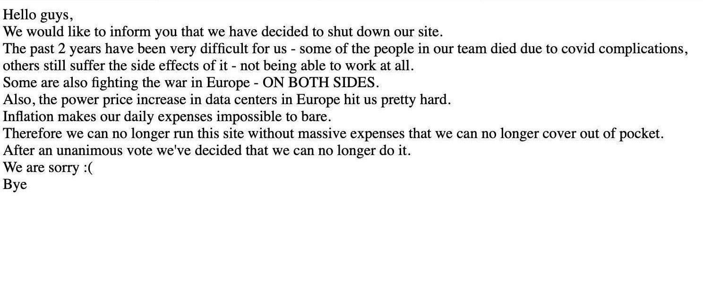
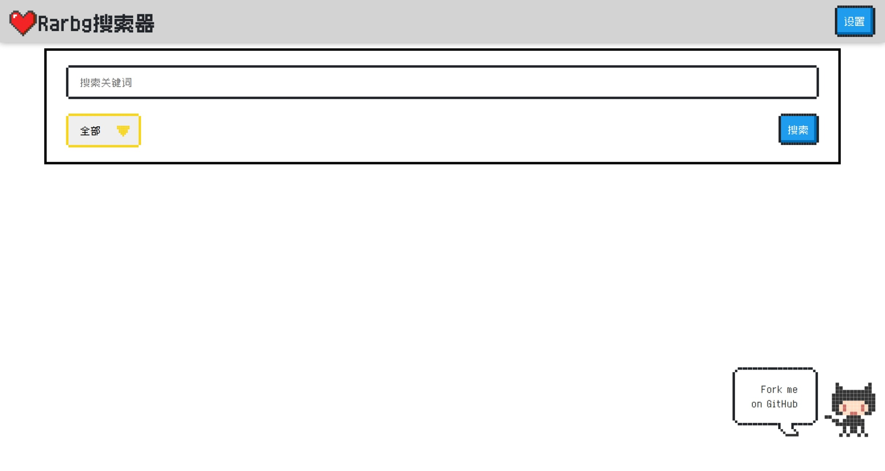
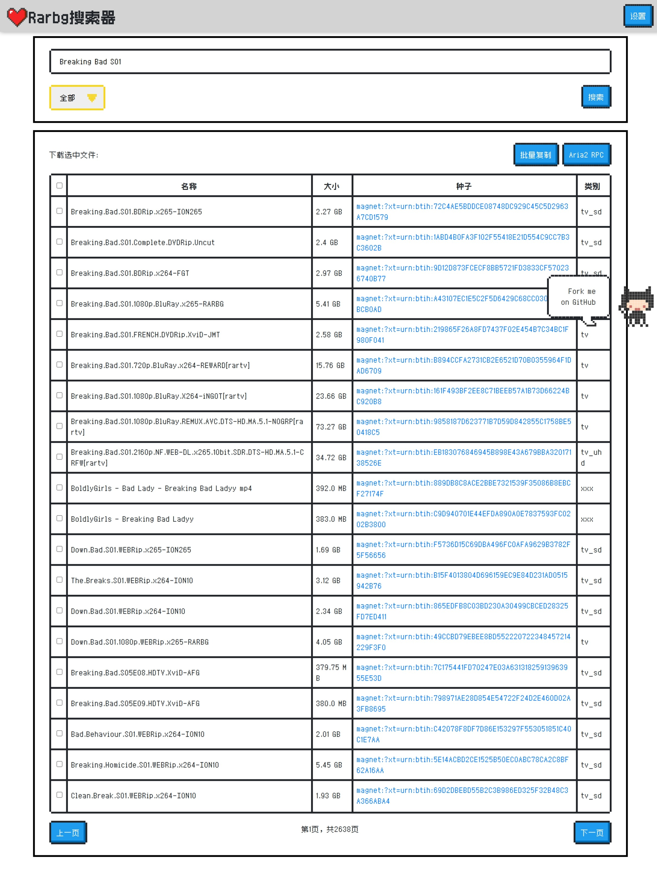
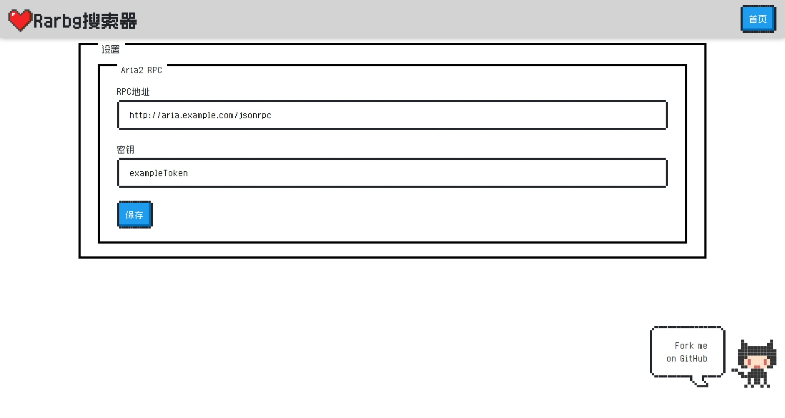

<div align="center">
    <h1>Rarbg 搜索器</h1>
</div>

## 介绍


<div align="center">
    <h3>R.I.P. Rarbg</h3>
</div>

Rarbg 数据库的搜索器，可以在本地快速搜索 Rarbg 的种子，并且可以设置 RPC 地址，一键发送至 ARIA2 进行下载。基于 Python3 Flask 开发，使用 MongoDB 作为数据库。

## 截图





## 使用方法

### 部署

1. 启动容器

```bash
git clone https://github.com/timlzh/rarbg-searcher
cd rarbg-searcher
docker-compose up -d
```

> 注意：首次启动会拉取镜像并创建索引，可能会比较慢。

1. 访问 <http://localhost:60100> 即可使用

## 鸣谢

- [NES.css](https://github.com/nostalgic-css/NES.css)
